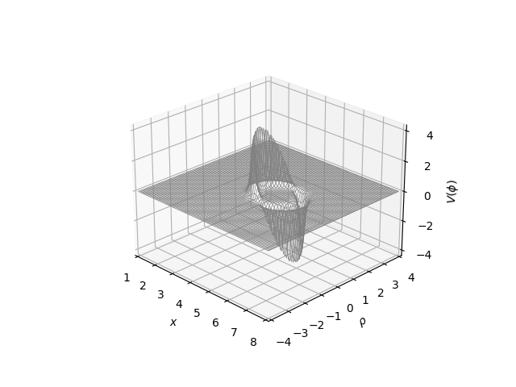
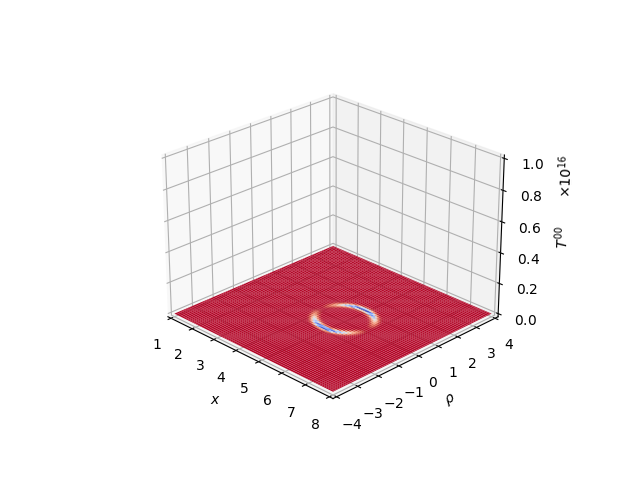

# 3D Plots of the Alcubierre Metric

These are (interactive) plots of energy density and york time for Alcubierre metric.

## Result

For best results (and interactive sliders to control both graphs), run these graphs in Jupyter, but here's a preview:





## Running

Ensure you have `jupyter` installed, then it's simply:

```
jupyter notebook
```

## Acknowlegements

Thanks very much to both Alcubierre (for the original paper), Dr. Harold White (for the original concept of these plots) and [ysnkhll](https://github.com/ysnkhll/Alcubierre-Warp-Drive) for the original implementation that this is based off of.
